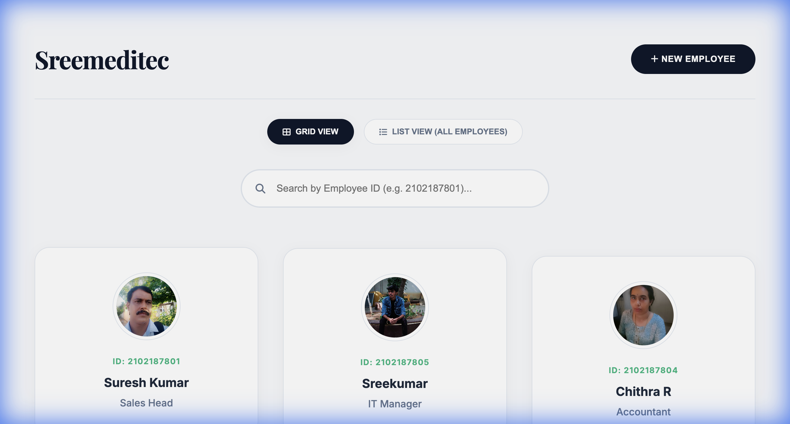

# Sreemeditec Personnel Management System

## 📋 Overview
The **Sreemeditec Personnel Management System** is a cutting-edge web application designed to digitalize and streamline the management of employee records. Built with a focus on **security, aesthetics, and performance**, this system serves as the central digital hub for Sreemeditec's workforce data.

It replaces static, paper-based records with a dynamic, interactive interface that provides instant access to critical personnel information, from professional roles to emergency contact details.

## 🚀 Key Features

### 1. 💎 Premium User Interface
- **Modern Aesthetic**: A visually stunning interface built with a curated color palette (`#0f172a` Navy, `#10b981` Emerald) and modern typography (Inter & Playfair Display).
- **Glassmorphism & Animations**: Smooth GSAP entrance animations and glass-morphic modify elements create a high-end user experience.
- **Responsive Design**: Fully optimized for desktops, tablets, and mobile devices.

### 2. 🔐 Secure Administration
- **Restricted Access**: The ability to add new personnel is protected by a secure authentication layer.
- **Access Control**: Only authorized administrators with the correct security credentials can access the registry forms.

### 3. 🔍 Advanced Directory & Search
- **Dual View Modes**: Switch seamlessly between a visual **Grid View** (cards) and a detailed **List View**.
- **Instant Search**: Real-time filtering allows administrators to find employees instantly by their unique Employee ID.

### 4. 📱 QR Code Integration
- **Digital Identity**: Each employee profile auto-generates a unique QR code.
- **Field Access**: Scanning the QR code instantly loads the employee's full digital profile, making verification in the field effortless.

### 5. 🛠️ Scalable Architecture
- **Firebase Connected**: Configured for Firebase integration to enable real-time cloud data storage.
- **Modular Codebase**: Built using modern ES Modules and Centralized Environment Variables (`env.js`) for security and maintainability.

---

## 🌟 Importance of this Project

### 1. Operational Efficiency
By centralizing data, we eliminate the need for scattered spreadsheets or physical files. Retrieving an employee's **Blood Group** or **Emergency Contact** takes seconds, not minutes.

### 2. Professional Branding
The system's premium design reflects Sreemeditec's commitment to quality and technology. It serves as an impressive touchpoint for clients and stakeholders who interact with the team.

### 3. Data Integrity & Security
Moving to a digital system ensures data is standardized. The password-protection feature ensures that the database cannot be tampered with by unauthorized users.

### 4. Future-Ready
This application lays the groundwork for advanced features like:
- **Real-time Geo-tracking** for field engineers.
- **Performance Analytics Dashboard**.
- **Automated Payroll Integration**.

---

## 💻 Technical Stack

- **Frontend**: HTML5, Semantic CSS3 (Variables, Grid/Flexbox), JavaScript (ES6 Modules).
- **Backend/Infrastructure**: Google Firebase (Configuration & Analytics).
- **Libraries**:
  - **GSAP (GreenSock)**: For cinema-grade UI animations.
  - **QRCode.js**: For dynamic QR code generation.
  - **FontAwesome**: For vector iconography.

---

